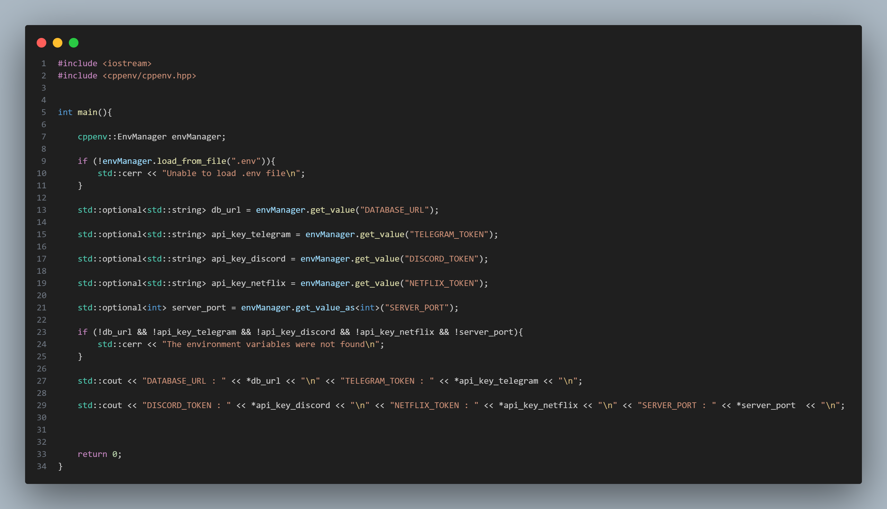

# cppenv

cppenv is a header-only C++ library that makes it easy to manage .env files in your projects.

---

## ✨ Features 

- Load `.env` files securely and easily

- Header-only : just include and use

- Simple API for accessing environment variables

- Ideal for config management in C++ projects

---

## 🚀 Quick Start


1. *Install :*  
    Just copy the cppenv directory into your project - no build step is required.

2. *Use :*

```cpp
#include <iostream>
#include <cppenv/cppenv.hpp>

using namespace cppenv::type;

int main(){

    cppenv::EnvManager envManager;

    if (!envManager.load_from_file(".env")){
        std::cerr << "Unable to load .env file\n";
    }
      
    OptString db_url = envManager.get_value("DATABASE_URL");

    OptString api_key_telegram = envManager.get_value("TELEGRAM_TOKEN");

    OptString api_key_discord = envManager["DISCORD_TOKEN"];

    OptString api_key_netflix = envManager["NETFLIX_TOKEN"];

    auto server_port = envManager["SERVER_PORT"]; // std::optional<int> server_port = envManager.get_value_as<int>("SERVER_PORT");

    if (!db_url && !api_key_telegram && !api_key_discord && !api_key_netflix && !server_port){
        std::cerr << "The environment variables were not found\n";
    }

    std::cout << "DATABASE_URL : " << *db_url << "\n" << "TELEGRAM_TOKEN : " << *api_key_telegram << "\n";

    std::cout << "DISCORD_TOKEN : " << *api_key_discord << "\n" << "NETFLIX_TOKEN : " << *api_key_netflix << "\n" << "SERVER_PORT : " << std::stoi(*server_port)  << "\n";


    return 0;
}
```

3. *screenshot :*


